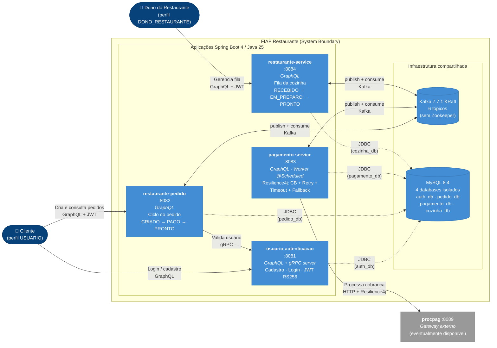

# C4 nível 2 — Containers

Abrindo a "caixa" do sistema FIAP Restaurante: mostra os 4 microsserviços, a infraestrutura compartilhada (MySQL + Kafka) e o tipo de tecnologia + protocolo em cada relacionamento.

> **"Container" no C4 é diferente de Docker.** No C4, container é qualquer **unidade executável** que armazena dados ou processa código — pode ser uma aplicação Spring Boot, um banco MySQL, um broker Kafka, um SPA Angular, um job batch. Não é container Docker. A coincidência de nome confunde, mas é assim na literatura.

> **Nota técnica:** este diagrama usa `flowchart LR` com estilos
> que mimetizam o visual C4 (cores e formas), porque o
> `C4Container` nativo do Mermaid faz auto-layout vertical com
> setas sobrepostas quando há muitos relacionamentos. A
> semântica C4 é mantida (Person, Container, ContainerDb,
> ContainerQueue, System_Ext) — só o renderizador é diferente.

## Leitura rápida

- **4 microsserviços Spring** — todos com a mesma stack (Java 25 + Spring Boot 4) e a mesma arquitetura interna (Hexagonal). O que muda é o que cada um faz.
- **1 instância MySQL** com **4 databases isolados** — abordagem *database per service* (sem joins entre bancos). Ver [ADR 0007](../adr/0007-database-per-service.md).
- **1 broker Kafka em KRaft** — sem Zookeeper. Ver [ADR 0006](../adr/0006-kafka-kraft.md).
- **3 protocolos de rede** em uso:
  - **GraphQL/HTTPS** — entrada externa para todos os 4 serviços
  - **gRPC** — única chamada síncrona interna (`restaurante-pedido` → `usuario-autenticacao`)
  - **Kafka** — toda a comunicação assíncrona entre os serviços
- **1 sistema externo** — `procpag` (gateway de pagamento, eventualmente disponível)

## Por que dois níveis de C4 e não mais?

O modelo C4 oferece **4 níveis** (Contexto, Container, Componente, Code). Para este projeto:
- **Nível 1 (Contexto)** — útil para apresentar o sistema rapidamente; está em [`c4-contexto.md`](c4-contexto.md).
- **Nível 2 (Container)** — este aqui; mostra a topologia técnica. É o nível mais usado em arquitetura de microsserviços.
- **Nível 3 (Componente)** — equivale a abrir cada Container e mostrar seus pacotes/classes. **Já está documentado** pela estrutura hexagonal nos READMEs de cada módulo + nos diagramas de sequência. Adicionar um C4-C3 formal seria redundante.
- **Nível 4 (Code)** — UML de classes; raramente usado, e nosso domínio é suficientemente simples para que ler o código direto seja mais útil.
