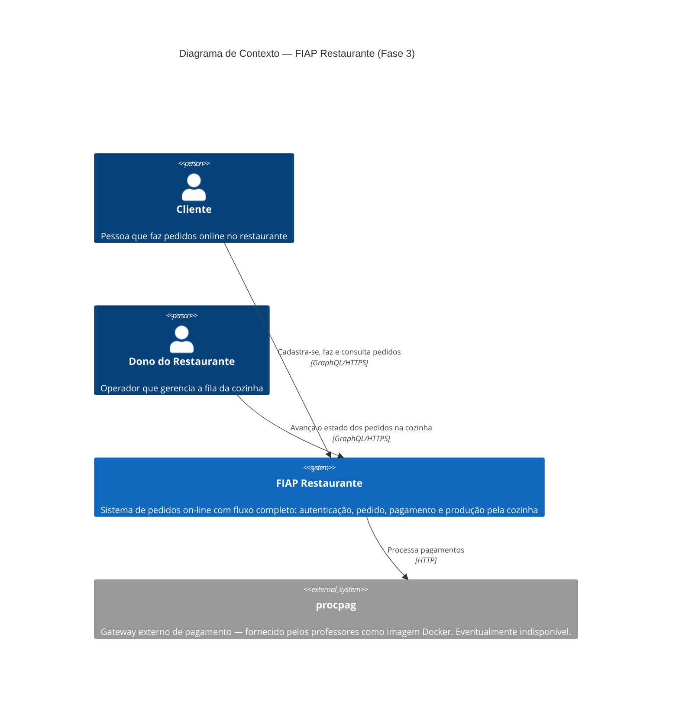

# C4 nível 1 — Contexto

Visão "do alto" — o sistema visto **de fora**, sem detalhes técnicos. Mostra os atores que interagem com o sistema e os sistemas externos com os quais ele se integra.

> **Para que serve esse nível?** É a primeira coisa que um stakeholder não-técnico (gerente, professor, cliente) precisa entender. Responde: "quem usa, com quem conversa, e qual o propósito?".

## Leitura rápida

- **2 atores humanos**: `Cliente` (perfil JWT `USUARIO`) e `Dono do Restaurante` (perfil `DONO_RESTAURANTE`).
- **1 sistema próprio** (o que construímos): `FIAP Restaurante`.
- **1 sistema externo**: `procpag` — gateway de pagamento que pode estar fora do ar; é justamente por causa dele que existe o capítulo de resiliência.

A complexidade interna (4 microsserviços, Kafka, hexagonal) **não aparece neste nível** — está no [Diagrama de Containers (C4 nível 2)](c4-containers.md).
