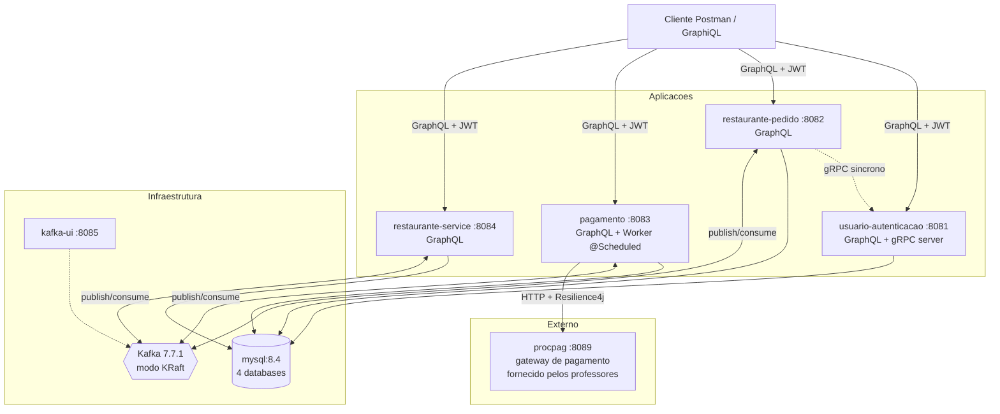

# Diagrama de componentes

Visão estática da arquitetura — os 4 microsserviços, as 4 peças de
infraestrutura, o gateway externo (`procpag`) e o cliente.

## Detalhamento dos serviços de aplicação

### `usuario-autenticacao` (porta 8081)

- **Função:** cadastro, login, emissão de JWT (RS256).
- **Database:** `auth_db` (usuarios).
- **Interface externa:** GraphQL em `/graphql`.
- **Interface interna:** servidor gRPC em `:9000` para validação
  síncrona pelos outros serviços.
- **Não consome nem publica eventos Kafka.**

### `restaurante-pedido` (porta 8082)

- **Função:** ciclo de vida do `Pedido` (criação, confirmação,
  consulta, atualização de status).
- **Database:** `pedido_db` (pedidos, itens_pedido).
- **Interface externa:** GraphQL em `/graphql`.
- **Publica:** `pedido.criado`, `pedido.pronto-para-cozinha`.
- **Consome:** `pagamento.aprovado`, `pagamento.pendente`,
  `pedido.em-preparo`, `pedido.pronto`.

### `pagamento-service` (porta 8083)

- **Função:** processamento de cobrança contra o `procpag` com
  resiliência (Circuit Breaker + Retry + Timeout + Fallback);
  worker `@Scheduled` reprocessa pendentes.
- **Database:** `pagamento_db` (pagamentos).
- **Interface externa:** GraphQL em `/graphql`.
- **Publica:** `pagamento.aprovado`, `pagamento.pendente`.
- **Consome:** `pedido.criado`.

### `restaurante-service` (porta 8084)

- **Função:** fila da cozinha (estados RECEBIDO → EM_PREPARO → PRONTO),
  mutations restritas a `DONO_RESTAURANTE`.
- **Database:** `cozinha_db` (pedidos_cozinha, itens_cozinha).
- **Interface externa:** GraphQL em `/graphql`.
- **Publica:** `pedido.em-preparo`, `pedido.pronto`.
- **Consome:** `pedido.pronto-para-cozinha`.

## Tópicos Kafka

| Tópico | Publicador | Consumidor(es) | Quando |
|---|---|---|---|
| `pedido.criado` | restaurante-pedido | pagamento | Após confirmação do cliente |
| `pagamento.aprovado` | pagamento | restaurante-pedido | Gateway autorizou |
| `pagamento.pendente` | pagamento | restaurante-pedido | Gateway indisponível |
| `pedido.pronto-para-cozinha` | restaurante-pedido | restaurante-service | Pedido virou PAGO |
| `pedido.em-preparo` | restaurante-service | restaurante-pedido | Dono iniciou preparo |
| `pedido.pronto` | restaurante-service | restaurante-pedido | Dono finalizou preparo |

A chave de cada mensagem é o `pedidoId.toString()`, garantindo que
todos os eventos do mesmo pedido caem na mesma partição (preserva
ordem por agregado).
