# Máquina de estados — agregado `Pedido`

Estados possíveis do agregado central `Pedido` no `restaurante-pedido`
e as transições válidas. Reflete o enum
`br.com.fiaprestaurante.restaurantepedido.domain.valueobject.StatusPedido`.

```mermaid
stateDiagram-v2
    [*] --> CRIADO: criarPedido()
    CRIADO --> CONFIRMADO: confirmar()
    CRIADO --> CANCELADO: cancelar()

    CONFIRMADO --> PAGO: marcarComoPago(pagamentoId)<br/>(evento pagamento.aprovado)
    CONFIRMADO --> PENDENTE_PAGAMENTO: marcarComoPendentePagamento()<br/>(evento pagamento.pendente)
    CONFIRMADO --> CANCELADO: cancelar()

    PENDENTE_PAGAMENTO --> PAGO: marcarComoPago()<br/>(worker reprocessou)
    PENDENTE_PAGAMENTO --> CANCELADO: cancelar()

    PAGO --> EM_PREPARO: marcarComoEmPreparo()<br/>(evento pedido.em-preparo)

    EM_PREPARO --> PRONTO: marcarComoPronto()<br/>(evento pedido.pronto)

    PAGO --> PRONTO: marcarComoPronto()<br/>(skip EM_PREPARO; idempotencia)

    PRONTO --> [*]
    CANCELADO --> [*]
```

## Regras de invariante

- **Estados terminais:** `PRONTO` e `CANCELADO`. Não há transições
  saindo deles.
- **`PAGO` não pode ser cancelado:** `cancelar()` lança
  `BusinessException` se o pedido já estiver pago — proteção
  contra cobrança sem entrega.
- **Idempotência em transições disparadas por eventos:** se o
  evento `pagamento.aprovado` chegar duas vezes (replay do Kafka),
  `marcarComoPago()` ignora a segunda chamada se já estiver em
  `PAGO`. Idem para `EM_PREPARO` e `PRONTO`.
- **`marcarComoEmPreparo` exige PAGO atual:** lança
  `BusinessException` se o status corrente não for `PAGO`.
- **`marcarComoPronto` aceita PAGO ou EM_PREPARO:** permite que a
  cozinha pule o estado intermediário caso o pedido seja muito
  simples (ex.: bebida engarrafada).

## Implementação

Toda a lógica de transição vive **dentro do agregado** `Pedido` —
métodos como `confirmar()`, `marcarComoPago()`, `cancelar()`. Os
use cases (`ConfirmarPedidoService`, `AtualizarStatusPagamentoService`,
`AtualizarStatusCozinhaService`) **apenas orquestram**: buscam o
agregado, chamam o método de transição, salvam.

Isso garante que **as regras nunca podem ser burladas** — não há
como mudar o estado por fora do agregado.
