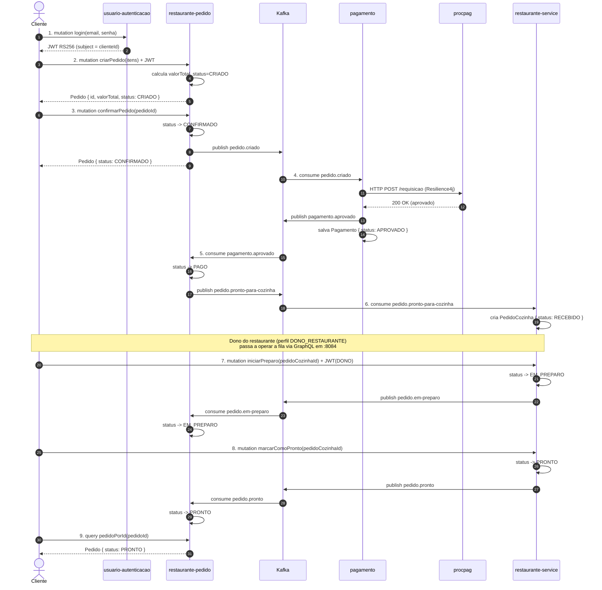

# Sequência — Happy Path (do cadastro à entrega)

Fluxo completo de um pedido bem-sucedido: cliente cria, paga e a
cozinha entrega. **9 passos**, cruzando os 4 microsserviços e o
gateway externo.

## Pontos a observar

- **Passos 1-3 são síncronos** do ponto de vista do cliente; o
  servidor responde imediatamente. O cliente nunca espera o
  pagamento.
- **Passos 4-9 são assíncronos** via Kafka — o ciclo completo do
  pedido (`CONFIRMADO → PAGO → EM_PREPARO → PRONTO`) acontece sem
  intervenção do cliente original; ele consulta o status quando
  quiser.
- **Passos 7 e 8** são acionados pelo **dono do restaurante**
  (perfil `DONO_RESTAURANTE` no JWT) via GraphiQL em `:8084` — a
  collection Postman atual cobre até o passo 6; cozinha é via
  GraphiQL.
- **Conversa via gRPC** entre `restaurante-pedido` e `usuario-autenticacao`
  pode ocorrer no passo 2 (validação de perfil); omitida do diagrama
  para legibilidade.
