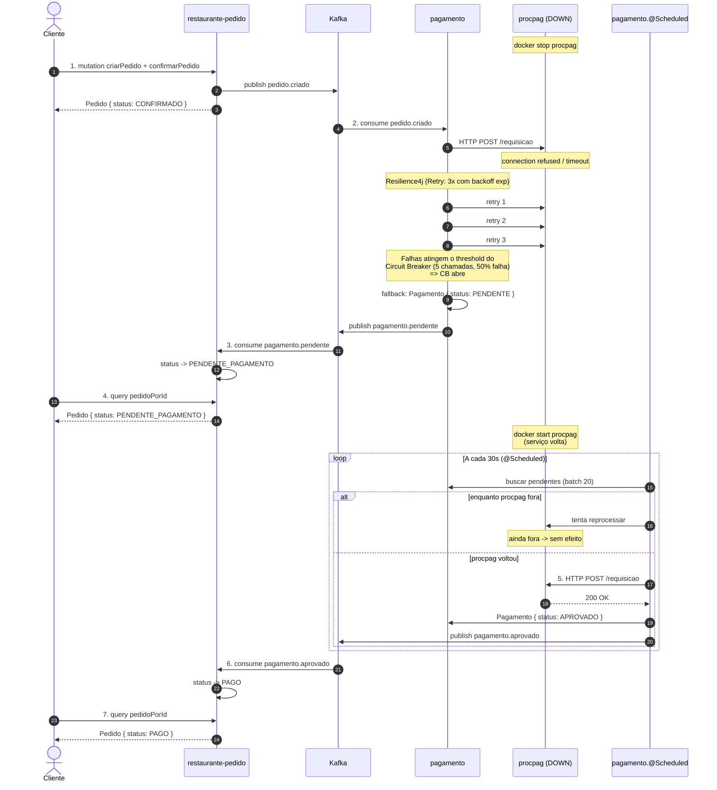

# Sequência — Resiliência (gateway indisponível)

Fluxo de **falha + recuperação** quando o gateway externo (`procpag`)
está fora do ar. Cobre os requisitos 4.5 (pagamento pendente) e 4.6
(reprocessamento automático).



## Pontos-chave

- **Cliente nunca recebe erro:** o passo 1 retorna `CONFIRMADO`
  normalmente, mesmo com o gateway fora. A falha fica isolada no
  `pagamento`.
- **Circuit Breaker abre rápido:** após 5 chamadas com 50% de
  falha (configurado no `application.properties` do pagamento),
  o CB abre. Chamadas subsequentes são **rejeitadas em ms** via
  `CallNotPermittedException` — não pagam o overhead de tentar.
- **Retry ignora `CallNotPermittedException`:** evita pagar 3
  retries quando o CB já está aberto.
- **Worker reprocessa por tempo indeterminado:** enquanto o
  `procpag` estiver fora, o worker continua tentando a cada 30s
  sem desistir. **Não há retry limit no nível do worker** — a
  premissa é "vai voltar uma hora".
- **Pedido converge para `PAGO`:** quando o worker tem sucesso,
  publica `pagamento.aprovado`, e o `restaurante-pedido` atualiza
  o status. Mesmo fluxo do happy path a partir daí.

## Como demonstrar

```bash
docker stop procpag                          # derruba o gateway
# Postman: criarPedido + confirmarPedido     # pedido vira PENDENTE_PAGAMENTO em ~10s
docker start procpag                         # gateway volta
# Aguarde ~30s -- worker reprocessa sozinho
# Postman: pedidoPorId                       # status: PAGO
```

Logs úteis durante a demo:

```bash
docker logs -f pagamento                                   # retries e CB
curl http://localhost:8083/actuator/circuitbreakers        # estado do CB
curl http://localhost:8083/actuator/scheduledtasks         # confirma worker ativo
```
